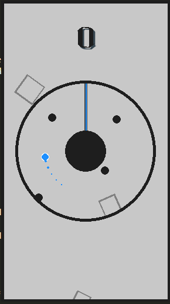

# Rotate Dash


Rotate Dash is a simple endless hypercasual arcade game made with pygame.

<p align='center'>
 
</p>

## Requirements

Use the package manager [pip](https://pip.pypa.io/en/stable/) to install following packages :-

* Pygame

```bash
pip install pygame
```

## Usage

Navigate and click main.py to open the game, Tap to start playing the game. The objective of the game is to touch generating lines without colliding with balls.

Controls:

* Tap anywhere to flip direction.
* press ESC to escape the game
